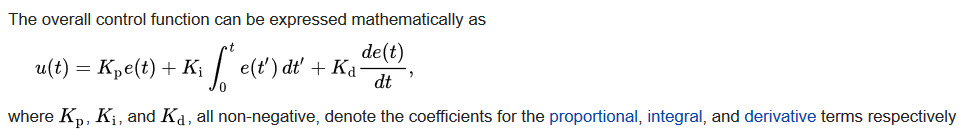

# Udacity Self-Driving Car Engineer Nanodegree


## Term 2 Project 4 : PID Controller
### Project Writeup

[](http://www.udacity.com/drive)

---


The goals / steps of this project are the following:

- Write a PID controller in C++
- Use the simulator to generate test data to test the PID controller

**Brief explanation of PID Controller**

***Definition***
A proportional–integral–derivative controller (PID controller or three term controller) is a control loop feedback mechanism widely used in industrial control systems and a variety of other applications requiring continuously modulated control. A PID controller continuously calculates an error value e ( t ) {\displaystyle e(t)} e(t) as the difference between a desired setpoint (SP) and a measured process variable (PV) and applies a correction based on proportional, integral, and derivative terms (denoted P, I, and D respectively) which give the controller its name. 

The three terms of a PID controller can be explained as below :

* P - Proportional Term :
This term will be proportional to the cross train error(cte) which is basically the difference between your current value and the value you want to achieve. 
In this case, the value we want to achieve is the middle of the road. The more is the difference between these two, the higher is this term. THis means that 
the more distance is the vehicle from the center of the lane, the more correction it makes and tries to steer to the middle.
Though this term tries to minimize the difference, it results in osciallations as it tries to correct till it reaches the middle lane, and then it overshoots.
Hence it results in slight oscillations. When this term is higher, the oscillations will be higher, and when it is lower, the car will correct itself slowly

* I - Integration Term :
This term accounts for past values of cte and integrates them over time. This takes care of the drift in the vehicle and smoothens the curve as it reaches the required value.
Let's assume the car has a drift and does not turn as expected with the steering angle. In this case, the cte is higher with time, and when you sum up all the cte's over time, the 
value is larger and hence it tries to correct itself over what is the current steering angle thus taking care of the drift

* D - Differential Term :
In order to prevent overshooting, the differential term is introduced. This is the best estimate of the future trend of cte, based on its current rate of change. As the vehicle is 
correcting itself towards the center of the lane, it calculates the rate of change of cte and adjusts itself so that the vehicle doesn't overshoot and thus prevent oscillations and achieve
a smooth transition

**Mathematical representation of PID controller :**



**Parameter Tuning :**

I tuned the parameters manually and haven't used twiddle method as auto tuning is leading to crashes sometimes if the values are not set accurately, and I had to restart the 
simulator from start. I've taken the output values from twiddle and worked from there.

I observed values of `Kp = 0.2, Kd=10.0, Ki=0.004" to be working well. I didn't observe any drift, but set a very minimal value just in case. 
I have increased the throttle to 0.6 when the steering angle is almost 0 which means its a straight line. In all other cases, this value will be 0.3

**Possible enhancements :**

One enhancement I could think of is to have an automated formula for throttle based on the angle.

---

### Installation & Setup
---

## Dependencies

* cmake >= 3.5
 * All OSes: [click here for installation instructions](https://cmake.org/install/)
* make >= 4.1(mac, linux), 3.81(Windows)
  * Linux: make is installed by default on most Linux distros
  * Mac: [install Xcode command line tools to get make](https://developer.apple.com/xcode/features/)
  * Windows: [Click here for installation instructions](http://gnuwin32.sourceforge.net/packages/make.htm)
* gcc/g++ >= 5.4
  * Linux: gcc / g++ is installed by default on most Linux distros
  * Mac: same deal as make - [install Xcode command line tools]((https://developer.apple.com/xcode/features/)
  * Windows: recommend using [MinGW](http://www.mingw.org/)
* [uWebSockets](https://github.com/uWebSockets/uWebSockets)
  * Run either `./install-mac.sh` or `./install-ubuntu.sh`.
  * If you install from source, checkout to commit `e94b6e1`, i.e.
    ```
    git clone https://github.com/uWebSockets/uWebSockets 
    cd uWebSockets
    git checkout e94b6e1
    ```
    Some function signatures have changed in v0.14.x. See [this PR](https://github.com/udacity/CarND-MPC-Project/pull/3) for more details.
* Simulator. You can download these from the [project intro page](https://github.com/udacity/self-driving-car-sim/releases) in the classroom.

There's an experimental patch for windows in this [PR](https://github.com/udacity/CarND-PID-Control-Project/pull/3)

## Basic Build Instructions

1. Clone this repo.
2. Make a build directory: `mkdir build && cd build`
3. Compile: `cmake .. && make`
4. Run it: `./pid`. 

Tips for setting up your environment can be found [here](https://classroom.udacity.com/nanodegrees/nd013/parts/40f38239-66b6-46ec-ae68-03afd8a601c8/modules/0949fca6-b379-42af-a919-ee50aa304e6a/lessons/f758c44c-5e40-4e01-93b5-1a82aa4e044f/concepts/23d376c7-0195-4276-bdf0-e02f1f3c665d)

## Editor Settings

We've purposefully kept editor configuration files out of this repo in order to
keep it as simple and environment agnostic as possible. However, we recommend
using the following settings:

* indent using spaces
* set tab width to 2 spaces (keeps the matrices in source code aligned)

## Code Style

Please (do your best to) stick to [Google's C++ style guide](https://google.github.io/styleguide/cppguide.html).

## Project Instructions and Rubric

Note: regardless of the changes you make, your project must be buildable using
cmake and make!

More information is only accessible by people who are already enrolled in Term 2
of CarND. If you are enrolled, see [the project page](https://classroom.udacity.com/nanodegrees/nd013/parts/40f38239-66b6-46ec-ae68-03afd8a601c8/modules/f1820894-8322-4bb3-81aa-b26b3c6dcbaf/lessons/e8235395-22dd-4b87-88e0-d108c5e5bbf4/concepts/6a4d8d42-6a04-4aa6-b284-1697c0fd6562)
for instructions and the project rubric.

---

### **Authors** <br/>
* Ravi Kiran Savirigana

### **Acknowledgements** <br/>
Thanks to Udacity for providing the startup code to start with. And a great community help from stackoverflow.com & github.com
